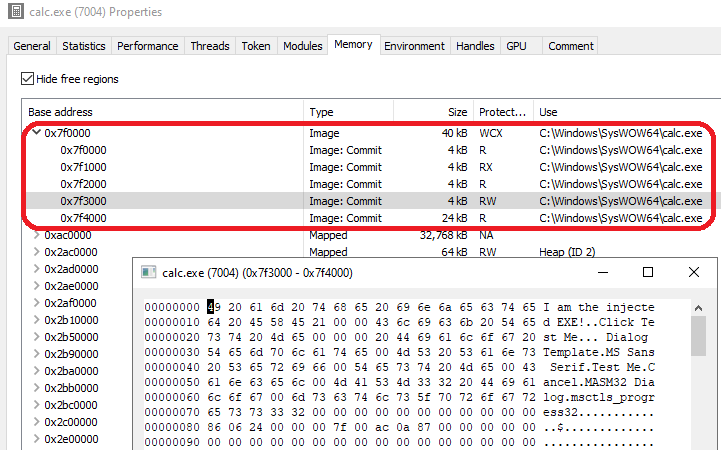

# Process Overwriting

[](https://ci.appveyor.com/project/hasherezade/process-overwriting)

Process Overwriting is a PE injection technique, closely related to [Process Hollowing](https://github.com/hasherezade/libpeconv/tree/master/run_pe) and [Module Overloading](https://github.com/hasherezade/module_overloading)

Process Hollowing (aka RunPE) is an old and popular PE injection technique. It comes in has variety of flavors, but there are some steps in common:
1. Start by creating a process in a suspended state
2. Write our own PE module in its memory
3. Redirect to the new module
4. Resume the thread

Process Hollowing does not require manual loading of payload's imports. Thanks to the step 3 Windows loader treat our PE implant as the main module of the process, and will load imports automatically when its execution resumes.

To make our implant recognized by Windows loader, its Module Base must be set in the PEB. It is usually done by one of the two ways:
+ in the most classic variant, the original PE is unmapped from memory, and the new PE is mapped on its place, at the same address.
+ in another, yet common variant, the old module is left as is, and another PE is mapped in a new memory region. Then the new module's base address is manually written into the PEB (this variant was demonstrated [here](https://github.com/hasherezade/libpeconv/tree/master/run_pe))

As a result of those classic implementations we get a payload running as main module, yet it is mapped as `MEM_PRIVATE` (not as `MEM_IMAGE` like typically loaded PEs).
To obtain payload mapped as `MEM_IMAGE` we can use some closely related techniques, such as [Transacted Hollowing](https://github.com/hasherezade/transacted_hollowing) or its variant ["Ghostly Hollowing"](https://github.com/hasherezade/transacted_hollowing#ghostly-hollowing).

*Process Overwriting is yet another take on solving this problem.*

In contrast to the classic Process Hollowing, we are not unmapping the original PE, but writing over it. No new memory is allocated: we are using the memory that was originally allocated for the main module of the process.

Pros:
+ the implanted PE looks like if it was loaded by Windows loader: 
  + mapped as `MEM_IMAGE`
  + divided into sections with specific access rights
  +  the image is named
+ convenience of loading: 
  + no need to manually relocate the implant prior to injection: Windows loader will take care of this - *in classic Process Hollowing we have to relocate the module!*
  + no need to fill imports (*like in every variant of Process Hollowing*)

Cons:
+ It doesn't work if the target has GFG (Control Flow Guard) enabled
+ The target's ImageSize must not be smaller than payload's ImageSize (remember we are using only the memory that was already allocated!) - *this limitation does not occur in other flavors of Process Hollowing*
+ Can be detected by comparing of the module in memory with corresponding file ([PE-sieve](https://github.com/hasherezade/pe-sieve/) detects it) - *just like every variant of Process Hollowing*

Demo:
-

The demo payload ([`demo.bin`](https://github.com/hasherezade/process_overwriting/blob/master/demo.bin)) injected into Windows Calc (default target):


In memory (via Process Hacker):



Clone:
-
Use recursive clone to get the repo together with all the submodules:
```console
git clone --recursive https://github.com/hasherezade/process_overwriting.git
```
